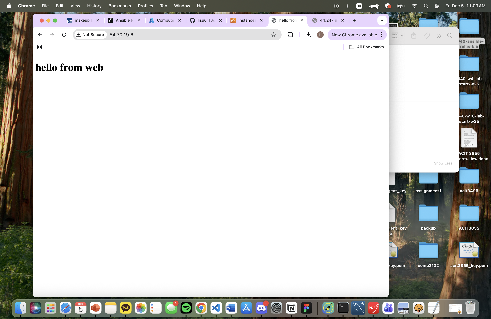

# acit4640-labwk14

## 1. SSH Key Upload Script

```bash
./scripts/import_lab_key <keyname>
```

## 2. Terraform Commands

```bash
cd terraform
terraform init
terraform validate
terraform plan
terraform apply
```

## 3. Ansible Commands

Test connection:

```bash
ansible -i ansible/inventory/aws_ec2.yml all -m ping
```

Run configuration:

```bash
cd ansible
ansible-playbook -i inventory/aws_ec2.yml playbook.yml
```

Ansible installs nginx and deploys:

* Web: `/var/www/html/index.html`
* DB: `/usr/share/nginx/html/index.html`

## 4. Validation Screenshots

### Web Server Output



## 5. Cleanup

```bash
cd terraform
terraform destroy
```